# Admin Dashboard Flow Chart

```mermaid
graph TD
    A[Admin Dashboard] --> B[Main Navigation]
    B --> C[Home/Dashboard]
    B --> D[User Management]
    B --> E[System Analytics]
    B --> F[Content Management]
    B --> G[System Settings]
    B --> H[Logout]

    C --> J[Stats Overview]
    J --> J1[Total Users]
    J --> J2[Active Classes]
    J --> J3[System Health]
    J --> J4[Storage Usage]

    D --> D1[User List]
    D1 --> D1a[Students]
    D1 --> D1b[Teachers]
    D1 --> D1c[Admins]
    D --> D2[User Roles]
    D --> D3[Permissions]
    D --> D4[User Activity]

    E --> E1[Usage Analytics]
    E1 --> E1a[User Engagement]
    E1 --> E1b[Feature Usage]
    E1 --> E1c[Performance Metrics]
    E --> E2[System Reports]
    E --> E3[Audit Logs]
    E --> E4[Error Tracking]

    F --> F1[Content Library]
    F1 --> F1a[Flashcard Decks]
    F1 --> F1b[Study Materials]
    F1 --> F1c[PDFs]
    F --> F2[Content Moderation]
    F --> F3[Storage Management]
    F --> F4[Backup/Restore]

    G --> G1[System Configuration]
    G1 --> G1a[Server Settings]
    G1 --> G1b[Database Settings]
    G1 --> G1c[API Settings]
    G --> G2[Security Settings]
    G --> G3[Email Settings]
    G --> G4[Maintenance]

    %% Mobile Navigation
    M[Mobile Bottom Nav] --> M1[Home]
    M --> M2[Users]
    M --> M3[Analytics]
    M --> M4[Settings]
    M --> M5[FAB - Quick Actions]

    %% Styling
    classDef default fill:#f9f9f9,stroke:#333,stroke-width:2px;
    classDef nav fill:#e1f5fe,stroke:#0288d1,stroke-width:2px;
    classDef feature fill:#f3e5f5,stroke:#7b1fa2,stroke-width:2px;
    classDef analytics fill:#fff3e0,stroke:#f57c00,stroke-width:2px;
    classDef system fill:#ffebee,stroke:#c62828,stroke-width:2px;
    classDef content fill:#e8f5e9,stroke:#2e7d32,stroke-width:2px;
    classDef mobile fill:#fce4ec,stroke:#c2185b,stroke-width:2px;

    class A,B,C,D,E,F,G,H nav;
    class J1,J2,J3,J4,D1,D1a,D1b,D1c,D2,D3,D4 feature;
    class E1,E1a,E1b,E1c,E2,E3,E4 analytics;
    class G1,G1a,G1b,G1c,G2,G3,G4 system;
    class F1,F1a,F1b,F1c,F2,F3,F4 content;
    class M,M1,M2,M3,M4,M5 mobile;
```

## Description

This flowchart represents the structure and navigation flow of the LearnMate Admin Dashboard. It includes:

1. **Main Navigation**
   - Home/Dashboard
   - User Management
   - System Analytics
   - Content Management
   - System Settings
   - Logout

2. **Dashboard Stats**
   - Total Users count
   - Active Classes count
   - System Health status
   - Storage Usage metrics

3. **User Management Section**
   - User List (Students, Teachers, Admins)
   - User Roles management
   - Permissions control
   - User Activity monitoring

4. **System Analytics Section**
   - Usage Analytics
     - User Engagement metrics
     - Feature Usage statistics
     - Performance Metrics
   - System Reports
   - Audit Logs
   - Error Tracking

5. **Content Management Section**
   - Content Library
     - Flashcard Decks
     - Study Materials
     - PDFs
   - Content Moderation
   - Storage Management
   - Backup/Restore functionality

6. **System Settings Section**
   - System Configuration
     - Server Settings
     - Database Settings
     - API Settings
   - Security Settings
   - Email Settings
   - System Maintenance

7. **Mobile Navigation**
   - Bottom Navigation Bar
   - Floating Action Button (FAB) for quick actions

The flowchart uses different colors to distinguish between:
- Navigation items (blue)
- Features and functionality (purple)
- Analytics features (orange)
- System settings (red)
- Content management (green)
- Mobile-specific elements (pink) 