# Teacher Dashboard Flow Chart

```mermaid
graph TD
    A[Teacher Dashboard] --> B[Main Navigation]
    B --> C[Home/Dashboard]
    B --> D[My Classes]
    B --> E[Student Groups]
    B --> F[Create Content]
    B --> G[Analytics]
    B --> H[Settings]
    B --> I[Logout]

    C --> J[Stats Overview]
    J --> J1[Active Classes]
    J --> J2[Total Students]
    J --> J3[Avg. Performance]
    J --> J4[Decks Created]

    D --> D1[Class List]
    D1 --> D2[Class Details]
    D2 --> D2a[Student List]
    D2 --> D2b[Assignments]
    D2 --> D2c[Flashcard Decks]
    D --> D3[Create New Class]

    E --> E1[Group List]
    E1 --> E2[Group Details]
    E --> E3[Create Group]
    E --> E4[Manage Students]

    F --> F1[Create Flashcard Deck]
    F --> F2[Create Assignment]
    F --> F3[Upload Materials]
    F --> F4[Manage Content]

    G --> G1[Class Performance]
    G --> G2[Student Progress]
    G --> G3[Learning Analytics]
    G --> G4[Reports]

    H --> H1[Theme Settings]
    H --> H2[Account Settings]
    H --> H3[Class Settings]

    %% Mobile Navigation
    M[Mobile Bottom Nav] --> M1[Home]
    M --> M2[Classes]
    M --> M3[Create]
    M --> M4[Analytics]
    M --> M5[FAB - Quick Actions]

    %% Styling
    classDef default fill:#f9f9f9,stroke:#333,stroke-width:2px;
    classDef nav fill:#e1f5fe,stroke:#0288d1,stroke-width:2px;
    classDef feature fill:#f3e5f5,stroke:#7b1fa2,stroke-width:2px;
    classDef content fill:#e8f5e9,stroke:#2e7d32,stroke-width:2px;
    classDef analytics fill:#fff3e0,stroke:#f57c00,stroke-width:2px;
    classDef mobile fill:#fce4ec,stroke:#c2185b,stroke-width:2px;

    class A,B,C,D,E,F,G,H,I nav;
    class J1,J2,J3,J4,D1,D2,D2a,D2b,D2c,D3,E1,E2,E3,E4 feature;
    class F1,F2,F3,F4 content;
    class G1,G2,G3,G4 analytics;
    class M,M1,M2,M3,M4,M5 mobile;
```

## Description

This flowchart represents the structure and navigation flow of the LearnMate Teacher Dashboard. It includes:

1. **Main Navigation**
   - Home/Dashboard
   - My Classes
   - Student Groups
   - Create Content
   - Analytics
   - Settings
   - Logout

2. **Dashboard Stats**
   - Active Classes count
   - Total Students count
   - Average Performance percentage
   - Decks Created count

3. **Classes Section**
   - Class List
   - Class Details
     - Student List
     - Assignments
     - Flashcard Decks
   - Create New Class

4. **Student Groups Section**
   - Group List
   - Group Details
   - Create Group
   - Manage Students

5. **Content Creation Section**
   - Create Flashcard Deck
   - Create Assignment
   - Upload Materials
   - Manage Content

6. **Analytics Section**
   - Class Performance
   - Student Progress
   - Learning Analytics
   - Reports

7. **Settings Section**
   - Theme Settings
   - Account Settings
   - Class Settings

8. **Mobile Navigation**
   - Bottom Navigation Bar
   - Floating Action Button (FAB) for quick actions

The flowchart uses different colors to distinguish between:
- Navigation items (blue)
- Features and functionality (purple)
- Content creation tools (green)
- Analytics features (orange)
- Mobile-specific elements (pink) 